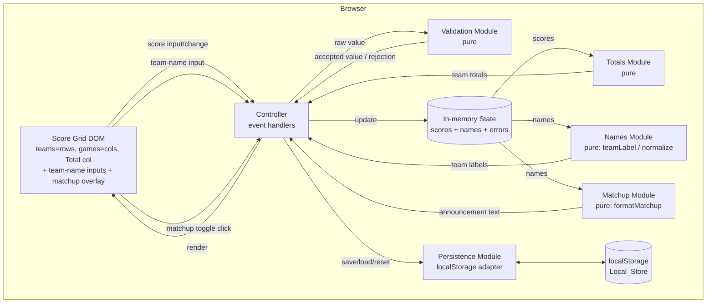
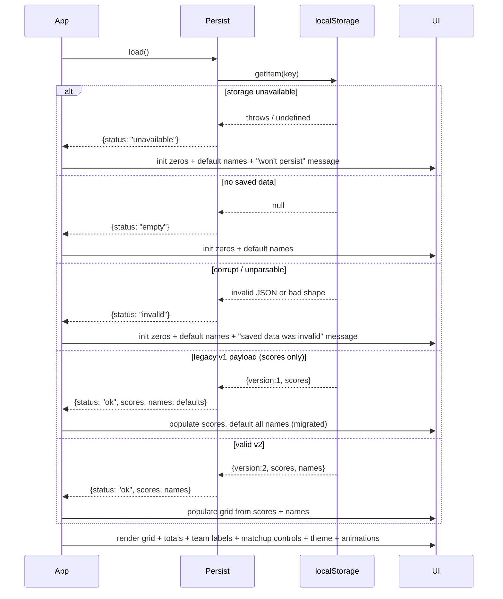

# Design Document

## Overview

The Halloween Party Scoring app is a single-page web application that runs entirely in the browser with no backend, no build step, and no accounts. It is served as a small set of static files placed in the workspace root — `index.html`, `styles.css`, and `app.js` — so the Host can open `index.html` directly on the TV-connected machine (or via any trivial static server) and start scoring immediately.

The app renders a score grid with **one row per team and one column per game**: four team rows, six game columns, plus a **rightmost Total column** that shows each team's running total prominently (large type) in its own row. The header row lists the game names, and head-to-head games carry a matchup control in their column header. The leftmost column of each row holds an **editable team-name field**. The Host types a point value into each cell; the app validates the input, updates that team's running total, and persists all scores and team names to `localStorage`. A spooky theme (near-black background, neon-green blackletter title, pink/orange/cream accents, Halloween icons, and ambient animations) matches the party invite while keeping the scoreboard readable from across the room on a big screen.

The Host can rename any team inline (the custom name replaces the default "Team A".."Team D" label everywhere the team appears) and can pop a large, room-readable **matchup announcement** overlay for any head-to-head game, with the current team names substituted in.

### Goals

- Zero setup: predefined teams and games, no configuration.
- Immediate, local-only operation: no network calls, no login, ready within 3 seconds.
- Live totals that recalc within 200ms of any change and stay visible in a prominent right-hand Total column (no scrolling required to see standings).
- Editable team names that persist alongside scores and survive a score reset.
- Per-game matchup announcements shown large on screen, using current team names.
- Durable scores and names across refresh/reopen via `localStorage`, with graceful degradation when storage is unavailable or corrupt, and backward-compatible migration of older saved data.
- High-contrast, large-type, TV-friendly presentation with tasteful ambient motion.

### Key Design Decisions

| Decision | Rationale |
|---|---|
| Vanilla HTML/CSS/JS, no framework, no bundler | The Host must be able to open `index.html` with no toolchain. A framework would require a build step and add weight for a fixed, tiny UI. |
| Pure functions for scoring/validation/persistence-serialization | Keeps the testable logic decoupled from the DOM so it can be exercised by property-based tests without a browser. |
| Single in-memory state object, re-rendered declaratively | The grid is small (4 team rows × 6 game columns plus a Total column); recomputing totals and re-rendering affected cells/labels on each change is well within the 200ms budget and avoids state-sync bugs. |
| Teams as rows, games as columns, Total column on the right | Puts each team's total in a large, always-visible right-hand cell within the team's own row. This fixes the prior totals-visibility problem, where totals lived in a sticky bottom row that could fall below the fold on some screens. |
| Structured matchup pairs in Config (not just a static string) | The announcement must substitute custom team names, but the human-readable matchup strings embed literal "Team A".."Team D". Carrying the matchup as team-id pairs lets `formatMatchup` build the text from live names, while the literal string is kept for a column tooltip. |
| Versioned persisted payload with migration | Adding team names changes the stored shape. Bumping to `version: 2` and migrating `version: 1` payloads (scores only) forward — instead of discarding them as invalid — ensures existing Hosts keep their scores. |
| `localStorage` with defensive parsing | The only persistence primitive available with no backend. All reads are validated and clamped so corrupt or foreign data can never crash the app. |
| CSS-only animations (`@keyframes`, `transform`/`opacity`) | GPU-composited transforms hit ≥30fps easily, keep motion off the layout (scores never move), and respect `prefers-reduced-motion` with a media query. |
| Inline SVG icons with emoji fallback | SVG scales crisply on a TV and can be styled/animated; emoji are the resilience fallback if an SVG fails to render. |

## Architecture

The app is organized into decoupled modules within `app.js`, separating pure logic (testable without a DOM) from rendering and persistence side effects.



### Module Responsibilities

- **Config module**: Immutable definitions of the four Teams (with default labels), six Games (in order), per-game matchup text, per-game structured `matchupPairs` (team-id pairs used to build announcements), and the set of games that permit negative scores (`Quiet Place` only). Single source of truth for Requirements 1, 2.4, and 12.
- **Validation module (pure)**: Given a raw string, a game id, and the current stored value, returns either an accepted integer or a rejection with the previous value preserved. No DOM access.
- **Totals module (pure)**: Given the score map for a team, returns the sum, treating missing cells as zero.
- **Names module (pure)**: Resolves a team's display label from the names map — `teamLabel(names, teamId)` returns the custom name when set to a non-empty string, otherwise the default label. Also normalizes a raw names map (coerce non-strings, trim, clamp to 30 chars, drop unknown teams, treat empty as unset). No DOM access. (Req 11.)
- **Matchup module (pure)**: `formatMatchup(pairs, names)` builds a game's matchup announcement text from its structured `matchupPairs`, substituting each team id with its current label via `teamLabel`. No DOM access. (Req 12.3, 12.4.)
- **Persistence module**: Wraps `localStorage` with `save`, `load`, and `clear`. Serializes/deserializes the `{ scores, names }` payload to/from JSON, validates and migrates loaded data (accepts both `version: 2` and legacy `version: 1`), and reports availability and failures without throwing.
- **Controller**: Wires DOM events (score inputs, team-name inputs, matchup toggles, reset) to the pure modules, owns the in-memory state, orchestrates render, save (debounced), reset flow, and the matchup overlay, and surfaces error indications and messages.
- **Render module**: Builds the grid (team rows, game columns, right-hand Total column), the team-name inputs, and the matchup overlay; updates cell values, total displays, team labels, and error markers. Reads state, writes DOM only.

### Startup Sequence



## Components and Interfaces

All logic lives in `app.js`. The pure modules below are written so they can be imported/exercised by tests without a DOM. The following signatures are described in TypeScript-style notation for clarity; the implementation is plain JavaScript.

### Config

```
type TeamId = "A" | "B" | "C" | "D";
type GameId =
  | "abcd-names" | "bone-finder" | "ghost-catcher"
  | "pumpkin-toss" | "quiet-place" | "human-centipede";

const TEAMS: { id: TeamId; label: string }[];        // default labels "Team A".."Team D"

type Matchup = [TeamId, TeamId];                      // one head-to-head pairing
const GAMES: {
  id: GameId;
  label: string;
  matchup?: string;                                   // human-readable string (Req 1.3), used for column tooltip
  matchupPairs?: Matchup[];                            // structured form for announcements (Req 12)
}[];

const NEGATIVE_ALLOWED: Set<GameId>;                  // { "quiet-place" }
const SCORE_MIN = -999, SCORE_MAX = 999;
const NAME_MAX_LEN = 30;                              // Req 11.5
```

The head-to-head games carry both the literal `matchup` string and a structured `matchupPairs`:

| Game | `matchup` (tooltip) | `matchupPairs` |
|---|---|---|
| Ghost Catcher | "Team A vs Team B & Team C vs Team D" | `[["A","B"], ["C","D"]]` |
| Pumpkin Toss | "Team A vs Team C & Team B vs Team D" | `[["A","C"], ["B","D"]]` |
| Quiet Place | "Team A vs Team D & Team B vs Team C" | `[["A","D"], ["B","C"]]` |

Games without a defined matchup (ABCD Names, Bone Finder, Human Centipede) omit both fields, so no matchup control is rendered for them (Req 12.2).

### Validation Module (pure)

```
type ValidationResult =
  | { ok: true;  value: number }
  | { ok: false; value: number; reason: "non-integer" | "out-of-range" | "negative-not-allowed" };

// previousValue is the currently stored Game_Score (defaults to 0).
function validateScoreInput(
  raw: string,
  gameId: GameId,
  previousValue: number
): ValidationResult;
```

Rules:
- Trim input. An empty string is treated as `0` (cleared cell) and is `ok`.
- Reject if not an integer (non-numeric, decimal, `NaN`, `Infinity`) → `reason: "non-integer"`, `value: previousValue`.
- Reject if the parsed integer is outside `[-999, 999]` → `reason: "out-of-range"`, `value: previousValue`.
- Reject if the value is `< 0` and `gameId` is not in `NEGATIVE_ALLOWED` → `reason: "negative-not-allowed"`, `value: previousValue`.
- Otherwise `ok: true` with the parsed integer.

### Totals Module (pure)

```
type ScoreMap = Record<TeamId, Record<GameId, number>>;

function teamTotal(scores: ScoreMap, team: TeamId): number; // sum over all six games, missing = 0
function allTotals(scores: ScoreMap): Record<TeamId, number>;
```

### Names Module (pure)

```
type NameMap = Record<TeamId, string>;  // custom names; "" or absent => default label

// Returns the custom name if set to a non-empty (post-trim) string, else the default "Team A".. label.
function teamLabel(names: NameMap, team: TeamId): string;

// Get/set semantics over a NameMap. setName clamps to NAME_MAX_LEN (30) chars.
function getName(names: NameMap, team: TeamId): string;              // "" when unset
function setName(names: NameMap, team: TeamId, raw: string): NameMap;// clamp to 30 chars, immutable update

// Coerces arbitrary parsed data into a clean NameMap:
//  - non-string values dropped, strings trimmed and clamped to 30 chars,
//  - unknown team ids dropped, missing teams left unset (=> default label).
function normalizeNames(raw: unknown): NameMap;
```

Rules:
- `teamLabel` treats an unset, empty, or whitespace-only custom name as "use the default label" (Req 11.4, 11.6).
- `setName`/`normalizeNames` clamp any name longer than 30 characters to 30 (Req 11.5).
- The default label for a team is its `TEAMS` entry label ("Team A".."Team D").

### Matchup Module (pure)

```
// Builds a game's announcement text from its structured pairs, substituting each
// team id with its current label. Preserves the pairing/grouping structure, e.g.
//   [["A","B"],["C","D"]] with names {A:"The Ghouls", B:"The Witches"}
//   => "The Ghouls vs The Witches  &  Team C vs Team D"
function formatMatchup(pairs: Matchup[], names: NameMap): string;
```

`formatMatchup` never emits a literal "Team X" for a team that has a custom name set — every id in the pairs is resolved through `teamLabel`, so custom names always appear and defaults are used only where no custom name exists (Req 12.3, 12.4).

### Persistence Module

```
type LoadResult =
  | { status: "ok";          scores: ScoreMap; names: NameMap }
  | { status: "empty" }
  | { status: "invalid" }
  | { status: "unavailable" };

type SaveResult  = { ok: true } | { ok: false };
type ClearResult = { ok: true } | { ok: false };

const STORAGE_KEY = "halloween-party-scoring:v1";  // localStorage key (unchanged)
const STORAGE_VERSION = 2;                         // bumped from 1 to add names

// loadScores never throws; validates & clamps into a full ScoreMap and a clean NameMap,
// and migrates legacy version:1 payloads forward.
function loadScores(): LoadResult;
// saveScores persists { version:2, scores, names }.
function saveScores(scores: ScoreMap, names: NameMap): SaveResult;
function clearScores(): ClearResult;  // removeItem, catch failures
```

`loadScores` normalizes any parsed data into a complete `ScoreMap` (unknown teams/games dropped, missing cells default to `0`, any value that is not an in-range integer — or a negative in a non-negative game — coerced to `0`) and a clean `NameMap` via `normalizeNames`. This guarantees the in-memory state is always well-formed regardless of stored content.

**Version handling / migration.** `loadScores` accepts two payload versions:

- **`version: 2`** — `{ version:2, scores, names }`: scores normalized as above, names normalized via `normalizeNames`.
- **`version: 1`** (legacy) — `{ version:1, scores }` with no `names`: **migrated forward**, not discarded. Its scores are loaded and normalized, and all names default (empty `NameMap`). This preserves the scores of Hosts who saved data before team names existed (Req 5 — no data loss).

Any other/unknown version, or a payload whose shape cannot be normalized, yields `status: "invalid"` (fall back to zeros + default names with a message). Because `STORAGE_KEY` is unchanged, a v1 payload is found at the same key and upgraded to v2 on the next save.

### Controller / Render (DOM-facing)

```
function initApp(): void;                       // load → build grid → render → wire events
function handleCellInput(team, game, raw): void;// validate → update state → render → debounced save
function handleNameInput(team, raw): void;      // clamp/update state.names → re-render affected labels → debounced save
function renderTotals(): void;                  // update the four right-hand Team_Total displays
function renderTeamLabels(): void;              // update each row label + any total label from teamLabel(names,...)
function renderMatchupAnnouncement(gameId): void;// render overlay content for a head-to-head game (substituted names)
function showMatchup(gameId): void;             // open the announcement overlay
function hideMatchup(): void;                   // dismiss the overlay (no score/name loss)
function toggleMatchup(gameId): void;           // open if closed / close if the same game is already open
function showCellError(team, game, reason): void;
function clearCellError(team, game): void;
function showMessage(text, kind): void;         // banner for save/load/reset/storage messages
function handleReset(): void;                   // open confirm dialog
function confirmReset(): void;                  // zero all scores, KEEP names; persist (names preserved); handle failure
```

Save is debounced (~250ms) so rapid typing (into either score cells or team-name fields) writes at most a few times while still satisfying the ≤1s persistence requirement.

**Team-name editing.** The controller attaches input listeners to the team-name fields (`[data-team-name="TEAMID"]`). On input it clamps the value to 30 chars, updates `state.names`, re-renders that team's affected labels (row label plus any total label) via `renderTeamLabels`, and schedules a save. Empty/whitespace names fall back to the default label at render time via `teamLabel` (Req 11.2, 11.4, 11.5, 11.6).

**Matchup overlay.** Matchup toggle controls (`[data-matchup-toggle="GAMEID"]`) exist only in head-to-head game column headers. Clicking toggles a dismissible overlay whose text is built by `formatMatchup(GAMES[gameId].matchupPairs, state.names)` and shown large for room readability. Toggling the same game's control again, or activating the overlay's dismiss control, hides it. Showing/hiding the overlay never mutates scores or names (Req 12.1–12.6).

**Reset keeps names.** `confirmReset` zeros every `Game_Score` but leaves `state.names` intact, then persists a payload with the zeroed scores and the preserved names (equivalently: clear the store, then immediately re-save `{ scores: zeros, names }`). Custom names survive a reset (Req 6.4, 11.7).

## Data Models

### In-Memory State

```
state = {
  scores: ScoreMap,                 // full 4×6 map, every cell an integer (0 when unset)
  names: NameMap,                   // custom team names; "" / absent => default label
  errors: Record<CellKey, string>,  // cells currently flagged invalid; CellKey = `${team}:${game}`
  entered: Set<CellKey>,            // cells the Host has actually entered (for empty-cell rendering)
  storage: "ok" | "unavailable",    // whether persistence is functioning this session
}
```

The `scores` map is the canonical scoring model. `Team_Total` values are derived (never stored) so they cannot drift from the underlying cells. A "cleared" cell is represented as `0`, and the grid renders `0`/unset cells as empty per Requirement 4.9 by tracking `entered` cells separately from their numeric value. The `names` map holds only custom names; display labels are always resolved through `teamLabel(names, team)`, so an empty or absent entry falls back to the default label (Req 11.4, 11.6).

### Persisted Shape (localStorage JSON)

The current payload is **version 2**, adding a `names` map alongside `scores`:

```json
{
  "version": 2,
  "scores": {
    "A": { "abcd-names": 4, "bone-finder": 0, "ghost-catcher": 0, "pumpkin-toss": 0, "quiet-place": -2, "human-centipede": 3 },
    "B": { "abcd-names": 0, "bone-finder": 0, "ghost-catcher": 0, "pumpkin-toss": 0, "quiet-place": 0, "human-centipede": 0 },
    "C": { "...": 0 },
    "D": { "...": 0 }
  },
  "names": { "A": "The Ghouls", "B": "The Witches", "C": "", "D": "" }
}
```

The `names` object maps team ids to custom names; teams with `""` or no entry render with their default label ("Team A".."Team D").

**Legacy version 1** payloads have the shape `{ "version": 1, "scores": { ... } }` with no `names` field. On load these are **migrated forward** rather than treated as invalid: their scores are loaded and normalized and all names default. The upgraded `{ version:2, scores, names }` payload is written back on the next save (same `STORAGE_KEY`). Only a payload whose `version` is neither 1 nor 2, or whose shape cannot be normalized, is treated as `invalid` (fall back to zeros + default names with a message).

### Theme Tokens (CSS custom properties in `styles.css`)

| Token | Value | Use |
|---|---|---|
| `--bg` | `#0d0d0d` | Full-viewport background (Req 7.1) |
| `--title` | `#b5e847` | Neon-green blackletter title (Req 7.2/7.3) |
| `--accent-pink` | `#f4a6c8` | Accent (Req 7.4) |
| `--accent-orange` | `#f08a24` | Accent (Req 7.4) |
| `--accent-cream` | `#f5f0e6` | Body text / accent (Req 7.4, contrast Req 7.6/9.2) |

Title font: a Google blackletter/gothic display font (e.g. **Pirata One**) with a `serif` fallback stack so the title stays neon-green even if the web font fails (Req 7.3). Body/score text uses cream `#f5f0e6` on `#0d0d0d` (contrast ≈ 17:1, well above 4.5:1). Score/label text is sized with `clamp()` to guarantee ≥24px at ≥1280px viewports (Req 9.1/9.4).

### Icons and Animations

- At least 8 of the 10 invite icons (black cat, skull, spider web, spider, witch hat, jack-o-lantern, potion bottle, bones, candle, moth) rendered as inline SVG, each with an emoji fallback if the SVG fails (Req 7.5, 8.5).
- Three ambient animations via CSS `@keyframes` on decorative-only elements: flickering candle (opacity/brightness), drifting spider (transform translate on a thread, ≤15% viewport displacement per cycle), twinkling stars (opacity). Animations use `transform`/`opacity` for GPU compositing (≥30fps) and are disabled under `@media (prefers-reduced-motion: reduce)` (Req 8).

## Correctness Properties

*A property is a characteristic or behavior that should hold true across all valid executions of a system — essentially, a formal statement about what the system should do. Properties serve as the bridge between human-readable specifications and machine-verifiable correctness guarantees.*

These properties target the pure logic modules (validation, totals, persistence serialization), which have clear input/output behavior over a large input space. Visual theme, animation, layout, and startup-timing criteria are not property-based tested — see the Testing Strategy for how those are covered.

### Property 1: Team total equals the sum of its game scores

*For any* score map, the `Team_Total` computed for a team SHALL equal the arithmetic sum of that team's six `Game_Scores`, with any missing or unset game score counted as zero.

**Validates: Requirements 2.3, 3.2, 3.3, 4.5**

### Property 2: Valid in-range integers are accepted

*For any* game and *any* integer value within -999 to 999 inclusive — excluding negative values for games other than "Quiet Place" — validating that value SHALL return an accepted result whose stored value equals the entered integer.

**Validates: Requirements 2.2, 2.4**

### Property 3: Invalid input is rejected and the previous value is retained

*For any* current stored value and *any* invalid input — a non-integer/non-numeric string, an integer outside -999 to 999, or a negative value for a game other than "Quiet Place" — validating that input SHALL return a rejection whose retained value equals the previous stored value.

**Validates: Requirements 2.5, 2.6**

### Property 4: Invalid entry leaves the affected team total unchanged

*For any* score map and *any* invalid input applied to any cell, the affected team's `Team_Total` after the attempted entry SHALL equal the `Team_Total` before the attempt.

**Validates: Requirements 3.6**

### Property 5: Negative totals display with a leading minus sign

*For any* integer team total, the formatted display string SHALL begin with a leading minus sign if and only if the total is negative, and SHALL otherwise preserve the total's magnitude digits exactly.

**Validates: Requirements 3.5**

### Property 6: Persistence round-trip is the identity

*For any* well-formed score map and *any* well-formed names map (each custom name a string of at most 30 characters), saving that `{ scores, names }` pair to the `Local_Store` and then loading it back SHALL yield a score map and names map equal to the originals.

**Validates: Requirements 5.1, 5.2, 5.4, 10.4, 11.3**

### Property 7: Loading arbitrary storage content yields a well-formed map without throwing

*For any* string content present in the `Local_Store`, loading SHALL never throw and SHALL either return a complete, well-formed score map (every team and game present, every value an in-range integer respecting the negative rule) or report an invalid/empty status that the app initializes to all zeros.

**Validates: Requirements 5.8**

### Property 8: Team label resolves to the custom name when set, else the default

*For any* team and *any* custom name, `teamLabel` SHALL return that custom name when it is a non-empty string of at most 30 characters, and SHALL return the team's default label ("Team A".."Team D") when the custom name is unset, empty, or whitespace-only.

**Validates: Requirements 11.2, 11.4, 11.5, 11.6**

### Property 9: Legacy version-1 storage migrates instead of being discarded

*For any* well-formed score map, storing it as a legacy `{ version: 1, scores }` payload and then loading SHALL succeed (never `invalid`), yielding a score map equal to the original and default (empty) team names — so pre-existing scores are never lost on upgrade.

**Validates: Requirements 5.4, 5.8, 10.4**

### Property 10: Matchup announcement substitutes current names and preserves structure

*For any* set of matchup pairs and *any* names map, `formatMatchup(pairs, names)` SHALL substitute every team id in the pairs with its `teamLabel`, SHALL contain no residual default "Team X" label for any team that has a custom name set, and SHALL preserve the number and grouping of the pairs.

**Validates: Requirements 12.3, 12.4**

### Property 11: Reset zeros all scores while preserving team names

*For any* score map and *any* names map, performing a confirmed reset SHALL leave the names map unchanged and set every `Game_Score` to zero.

**Validates: Requirements 6.4, 11.7**

## Error Handling

| Condition | Detection | Response | Requirement |
|---|---|---|---|
| Non-integer / non-numeric entry | Validation module | Reject, retain previous value, flag the specific `Score_Cell` with an error indication | 2.6, 3.6 |
| Out-of-range integer (outside -999..999) | Validation module | Reject, retain previous value, flag cell, leave total unchanged | 3.6 |
| Negative entry in a non-"Quiet Place" game | Validation module | Reject, retain previous value, flag cell | 2.5 |
| `localStorage` write fails (quota/exception) | `try/catch` around `setItem` | Keep in-memory scores and names, show "data could not be saved" banner, continue | 5.3 |
| `localStorage` read fails | `try/catch` around `getItem` | Initialize zeros + default names, show "saved data could not be loaded" banner, continue | 5.7 |
| Stored data unparsable / wrong shape / unknown version | JSON parse + shape validation in `loadScores` | Initialize zeros + default names, show "saved data was invalid" banner, continue | 5.8 |
| Legacy `version: 1` payload (scores only) | Version check in `loadScores` | Migrate: load scores, default all names, re-save as v2 on next write (no data loss) | 5.4 |
| Team name exceeds 30 characters | Clamp in `setName` / `normalizeNames` | Store the first 30 characters | 11.5 |
| `localStorage` entirely unavailable (private mode, disabled) | Feature-probe on init | Run session in-memory, show "scores will not persist" banner, continue full scoring | 10.5 |
| Reset clear fails | `try/catch` around `removeItem` | Retain prior saved scores and names, show "reset did not complete" banner | 6.5 |
| Decorative SVG animation cannot render | Fallback markup / feature check | Omit the affected decoration, scores keep rendering uninterrupted | 8.5 |
| Title web font fails to load | CSS fallback stack | Render title in serif fallback, preserve neon-green color | 7.3 |

Error indications on cells are cleared automatically when the Host next enters a valid value in that cell. Banner messages are non-blocking and dismissible so scoring is never interrupted.

## Testing Strategy

The app is tested with a **dual approach**: property-based tests for the pure logic (validation, totals, name resolution, matchup formatting, persistence serialization/migration, formatting) and example/integration tests for structure, styling, layout, timing, and error-flow behavior.

### Tooling

- **Test runner + property library**: [fast-check](https://github.com/dubzzz/fast-check) with a lightweight runner (Vitest or Jest). fast-check is the standard property-based testing library for JavaScript — it is used as-is; property testing is not implemented from scratch.
- The pure modules are written to be importable without a DOM so property tests run headless. DOM-facing tests use jsdom (or the runner's built-in DOM environment).
- Contrast, font-size, and layout checks use computed-style assertions in the DOM environment; animation checks inspect the presence and shape of CSS rules and the `prefers-reduced-motion` media query.

### Property-Based Tests

- Each of Properties 1–11 is implemented as a **single** property-based test.
- Each test runs a **minimum of 100 iterations**.
- Each test is tagged with a comment referencing its design property in the form:
  `// Feature: halloween-party-scoring, Property {number}: {property_text}`
- Generators:
  - Score maps: 4 teams × 6 games of integers in a realistic range including negatives for `quiet-place` and boundary values ±999.
  - Valid inputs (P2): integers in `[-999, 999]`, filtered per game negative rule.
  - Invalid inputs (P3): a union of non-integer strings (decimals, letters, empty-after-symbols, `NaN`/`Infinity` text), out-of-range integers, and negatives paired with non-"Quiet Place" games. Include edge cases: leading/trailing whitespace, `+`/`-` signs, very large numbers, unicode digits.
  - Storage content (P7): arbitrary strings plus deliberately malformed JSON and valid-JSON-with-wrong-shape, so robustness is exercised against both garbage and plausible-but-invalid data.
  - Names maps and names (P6, P8, P10): a mix of unset, empty/whitespace-only, normal, and over-length (>30 char) strings, plus unicode, so the clamp and default-fallback branches are exercised.
  - Legacy payloads (P9): a well-formed score map wrapped as `{ version: 1, scores }`.
  - Matchup pairs (P10): sequences of team-id pairs paired with names maps that set custom names for some or all teams.

### Example-Based Unit Tests

- Config correctness: exactly four teams (A–D) and six games in the required order (Req 1.1, 1.2); matchup strings and structured `matchupPairs` for Ghost Catcher, Pumpkin Toss, Quiet Place and absence of both elsewhere (Req 1.3, 1.4, 12.1, 12.2).
- Grid structure (**updated orientation**): the grid now has **4 team rows × 6 game columns plus a rightmost Total column**. The 24 score inputs still exist, each tagged with its team+game via `data-team`/`data-game`; assertions now check row-per-team / column-per-game orientation (game names in the header row, editable name field in each row's left column) rather than the prior bottom-row totals. Four Total cells `[data-total="TEAMID"]` sit at the right end of their rows; empty cells render empty (Req 2.1, 3.1, 4.1–4.6, 4.9).
- Team-name editing: entering a custom name in `[data-team-name="TEAMID"]` updates the row label and the total's label to the custom name (Req 11.2); clearing it (empty/whitespace) falls back to the default label (Req 11.4, 11.6); an input longer than 30 chars is clamped to 30 (Req 11.5); the name persists and is restored on reload together with scores (Req 11.3, mocked `localStorage`).
- Matchup toggle: a `[data-matchup-toggle]` control exists only in head-to-head game headers (Req 12.1, 12.2); activating it shows the overlay with the matchup text using current team names (Req 12.3, 12.4); activating it again or the dismiss control hides the overlay (Req 12.5); showing/dismissing the overlay leaves `state.scores` and `state.names` unchanged (Req 12.6).
- Total-column live update (**regression test for the reported totals-visibility bug**): entering a score updates that team's `[data-total="TEAMID"]` cell, and that element is the right-hand Total cell within the team's row (always on screen, not a bottom sticky row) (Req 3.5, 3.6, 4.5, 4.10).
- Persistence error flows with a mocked `localStorage`: write failure (Req 5.3), read failure (Req 5.7), no saved data → zeros + default names (Req 5.4, 5.5, 5.6), legacy v1 payload migrates to scores + default names (Req 5.4), unavailable storage → in-memory + message (Req 10.5).
- Reset flow: confirm/cancel dialog leaves scores unchanged until choice (Req 6.1); confirm zeros all and clears saved scores (Req 6.2); cancel retains everything (Req 6.3); confirm retains team names in memory and store (Req 6.4, 11.7); clear failure retains prior data + message (Req 6.5).

### Integration / Rendering / Timing Tests

- Recalc latency: a score change updates the displayed total in under 200ms (Req 3.4).
- Startup: load-to-interactive under 3s with no backend network request (Req 10.3); no external transmission of scores (Req 10.1); no login required (Req 10.2).
- Readability at ≥1280px viewport: computed font size ≥24px for team labels, game labels, cell values, and totals; no horizontal scrolling or clipping (Req 9.1, 9.3, 9.4).
- Theme: background `#0d0d0d` fills the viewport (Req 7.1); title color `#b5e847` with blackletter font and serif fallback (Req 7.2, 7.3); pink/orange/cream each applied to at least one element (Req 7.4); at least 8 of 10 icons present (Req 7.5); scoring-text contrast ≥4.5:1 and title/large-text contrast ≥3:1 (Req 7.6, 9.2).
- Animations: candle, spider, and stars animations defined and running; motion confined to decorations with displacement ≤15% of viewport per cycle (Req 8.1, 8.3, 8.4); `prefers-reduced-motion` disables motion; a failed decoration is omitted without interrupting scores (Req 8.5). Frame-rate target (≥30fps, Req 8.2) is met by using GPU-composited `transform`/`opacity` keyframes and is verified by manual/visual check on the target display, since headless fps measurement is unreliable.

### Coverage Notes

Requirement 1.5 (no setup) and 4.8 (single screen) are validated by smoke/structural checks that the grid renders fully on load with no configuration step. Requirement 4.11 (labels, game headers, and Total column stay visible while cells scroll) is covered by a layout/computed-style check. All twelve requirements are covered across the property, unit, and integration suites above.
